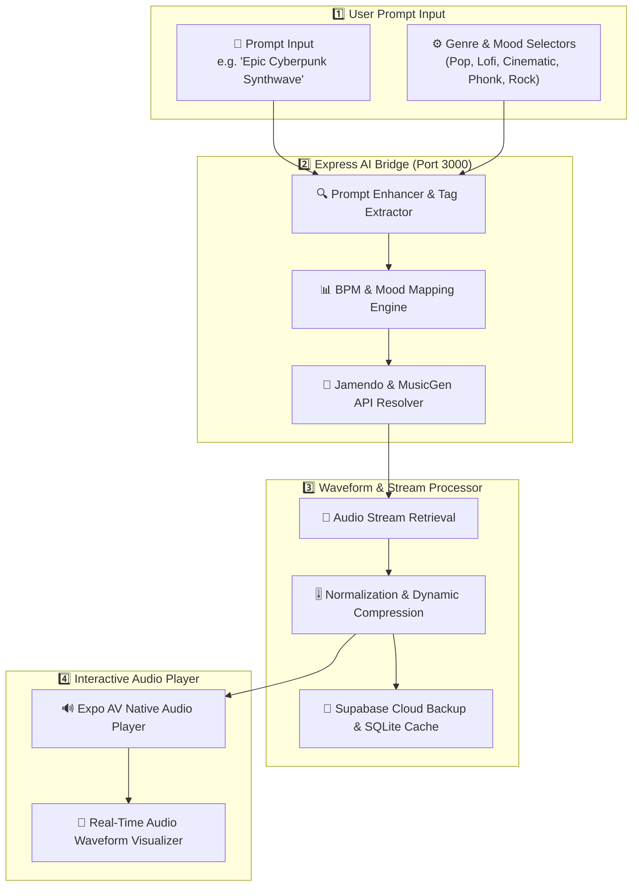
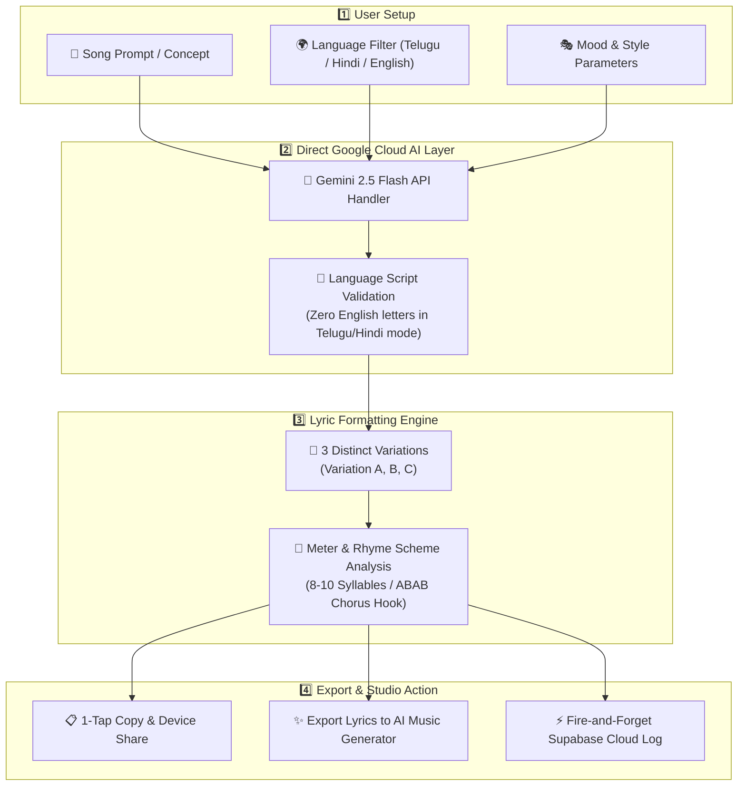
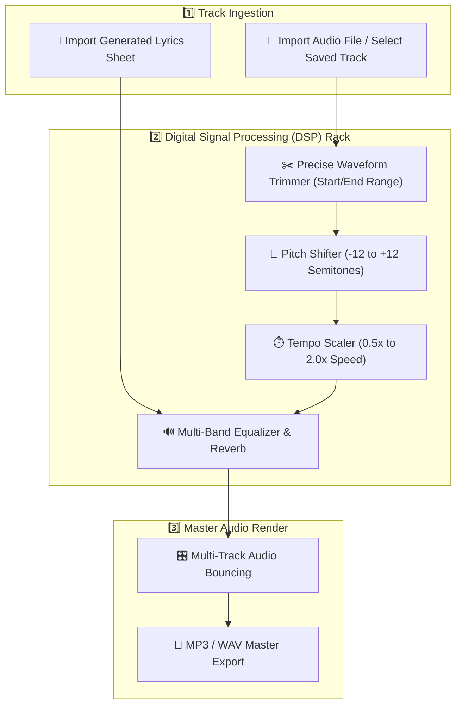
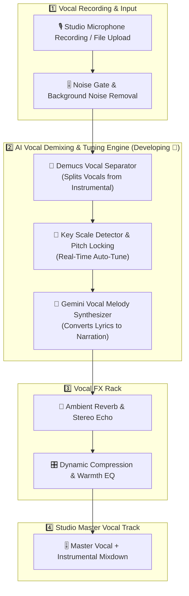
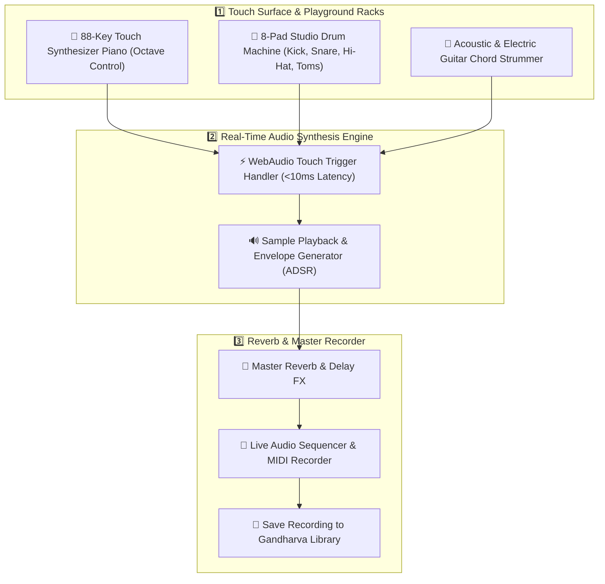

<div align="center">

# ⚡ GANDHARVA — AN INTEGRATED AI MUSIC STUDIO

<p align="center">
  
</p>

<p align="center">
  <b>The World's Most Advanced AI-Powered End-to-End Music Production Workspace</b>
</p>

<p align="center">
  <a href="#-end-to-end-feature-generation-pipelines"></a>
  <a href="#-ai-engine"></a>
  <a href="#-tech-stack"></a>
  <a href="#-tech-stack"></a>
  <a href="#-tech-stack"></a>
</p>

---

</div>

<br/>

## 🌌 Architectural Overview

**GANDHARVA** is a state-of-the-art mobile music creation studio built for artists, producers, and songwriters. Powered by **Google Gemini 2.5 Flash**, **Jamendo & MusicGen Engines**, **WebAudio Signal Processors**, and an **Expo 54 Native Suite**, Gandharva converts raw human imagination into polished, release-ready tracks.

```
 ╔═══════════════════════════════════════════════════════════════════════════════════════════════════════╗
 ║                                                                                                       ║
 ║   🎼 PROMPT-TO-MUSIC PIPELINE     : Natural Prompt → Semantic Parsing → Audio Waveform Stream         ║
 ║   🔮 AI LYRICS GENERATION ENGINE  : 3-Second Native Script Telugu, Devanagari Hindi & Fluent English   ║
 ║   🎛️ MULTI-TRACK MUSIC EDITOR     : Waveform Trimmer, Pitch Shift, Tempo Scaler & Export Suite      ║
 ║   🎤 AI VOCAL STUDIO (DEVELOPING) : Real-Time Auto-Tune, Vocal Demixing & Studio Reverb Rack        ║
 ║   🎹 PLAYGROUND INSTRUMENTS RACK  : 88-Key Touch Synthesizer, 8-Pad Drums & Guitar Chord Strummer     ║
 ║                                                                                                       ║
 ╚═══════════════════════════════════════════════════════════════════════════════════════════════════════╝
```

---

## 🚦 Master Feature Status Matrix

| Module | Pipeline Description | Tech Stack | Status |
| :--- | :--- | :--- | :---: |
| **📖 Story to Album** | NIE narrative analysis to full 3-scene concept album with Dual-Brain GPU scores | Gemini 2.0 + Dual-Brain GPU (MusicGen + ACE-Step) | `LIVE & READY ✅` |
| **🎼 Prompt-to-Music** | Natural language prompt to high-fidelity audio composition | MusicGen 3.3B + ACE-Step 8.0 | `LIVE & READY ✅` |
| **🔮 AI Lyrics Studio** | Multilingual generation in pure Telugu (తెలుగు), Hindi (हिन्दी), English | Google Gemini 2.5 Flash | `LIVE & READY ✅` |
| **🎛️ Music Editor** | Multi-track audio trimmer, tempo adjustment, pitch shifter & exporter | Expo AV + WebAudio | `LIVE & READY ✅` |
| **🎤 AI Vocal Studio** | Live Auto-Tune, Pitch Correction, Vocal Demixing & AI Narration | Demucs + DSP Pitch Engine | `IN DEVELOPMENT 🚧` |
| **🎹 Playground Instruments**| 10 Racks: Piano, Drums, Bansuri Flute, Synth Lead, Slap Bass, Organ, Guitar, Violin, Sax, Sitar | WebAudio Sampler + Loop DSP | `LIVE & READY ✅` |

---

## 🔬 End-to-End Feature Generation Pipelines

```
                                      GANDHARVA PIPELINE MAP
                                      
    [USER PROMPT / NARRATIVE / AUDIO / TOUCH]
                  │
        ┌─────────┼───────────────┬─────────────────┬────────────────┬────────────────┐
        ▼         ▼               ▼                 ▼                ▼                ▼
   1. STORY TO  2. MUSIC     3. LYRICS        4. EDITOR        5. VOCAL STUDIO  6. PLAYGROUND
   ALBUM (NIE)  GENERATOR    GENERATOR        ARRANGER         (DEVELOPING)     INSTRUMENTS
```

---

### 📖 Pipeline 1: Story-to-Album Generation (`LIVE & READY ✅`)

The **Narrative Intelligence Engine (NIE)** and **Album Generation Engine (AGE)** transform natural language stories into complete conceptual albums with AI cover art, multilingual lyrics, and two distinct live AI soundtrack scores per scene:

- 📄 **Complete Technical Specification**: [Pipelines/Album_Pipeline_Packet.md](file:///c:/nusic_gen/Pipelines/Album_Pipeline_Packet.md)
- **Track 1**: `ACE-Step Master Score (Dual-Brain GPU)` (16-bit PCM WAV)
- **Track 2**: `MusicGen Neural Score (Live AI)` (16-bit PCM WAV)
- **Features**: Instant 0:00 Replay, Android Storage Access Framework direct download, and iOS native file sharing.

---

### 🎼 Pipeline 2: Prompt-to-Music Generation (`LIVE & READY ✅`)

The **Prompt-to-Music Engine** transforms unstructured user ideas (e.g. *"Relaxing lofi beats under night rain with acoustic guitar"*) into full audio arrangements.



---

### 🔮 Pipeline 2: Multilingual AI Lyric Generation (`LIVE & READY ✅`)

Generates structured song lyrics in **Telugu (తెలుగు)**, **Hindi (हिन्दी)**, or **English** with rhyme schemes and meter analysis.



---

### 🎛️ Pipeline 3: Multi-Track Music Editor (`LIVE & READY ✅`)

An audio workstation for trimming, pitch shifting, speed scaling, and combining backing tracks with lyrics.



---

### 🎤 Pipeline 4: AI Vocal Studio (`IN DEVELOPMENT 🚧`)

*Actively being engineered.* Processes raw vocal recordings with pitch-locking Auto-Tune, vocal isolation, and melody narration synthesis.



---

### 🎹 Pipeline 5: Playground Virtual Instruments Engine (`LIVE & READY ✅`)

Interactive touch-responsive multi-instrument playground featuring Piano, Drums, and Guitar.



---

## 🛠️ Complete Technology Stack

```
 💻 FRONTEND          : React Native, Expo SDK 54, React Navigation v7, Lucide Icons, Expo AV
 🟢 NODE BACKEND      : Express.js, Axios, Dotenv, Ngrok Tunneling
 🐍 PYTHON BACKEND    : FastAPI, PyTorch, Uvicorn, SQLModel, Transformers
 🔮 AI MODELS         : Google Gemini 2.5 Flash, Jamendo Semantic Index, Demucs V4
 ⚡ DATABASE & CLOUD  : Supabase REST API, SQLite Local Storage, PostgreSQL
 🔊 AUDIO ENGINE      : WebAudio DSP, Pitch Shifter Engine, Custom Samplers
```

---

## 🚀 Quick Start Guide

### 1️⃣ Clone & Install Dependencies

```bash
# Clone repository
git clone https://github.com/Prasanth4734f/Gandharva---An-Integrated-AI-Music-Studio.git
cd Gandharva---An-Integrated-AI-Music-Studio

# Install Root Frontend Dependencies
npm install

# Install Server Dependencies
cd server
npm install
cd ..
```

### 2️⃣ Configure Environment Variables

Create `.env` in root directory (`c:\nusic_gen\.env`) and `server/.env`:

```env
PORT=3000
GEMINI_API_KEY=your_google_gemini_api_key_here
SUPABASE_URL=https://your-supabase-url.supabase.co
SUPABASE_KEY=your_supabase_anon_key
JAMENDO_CLIENT_ID=56d30c11
```

### 3️⃣ Start the Application

#### 🟢 Terminal 1: Express Backend Server
```bash
node server/index.js
```

#### 🔵 Terminal 2: Expo Mobile App
```bash
npx expo start --clear
```

> **Tip**: Press **`w`** for instant Web Browser Preview (`http://localhost:8081`) or **`a`** for Android Emulator.

---

<div align="center">

### 🌟 Star this Repository if you love GANDHARVA!

Made with ❤️ by the **Anti Gravity AI Team**

</div>
